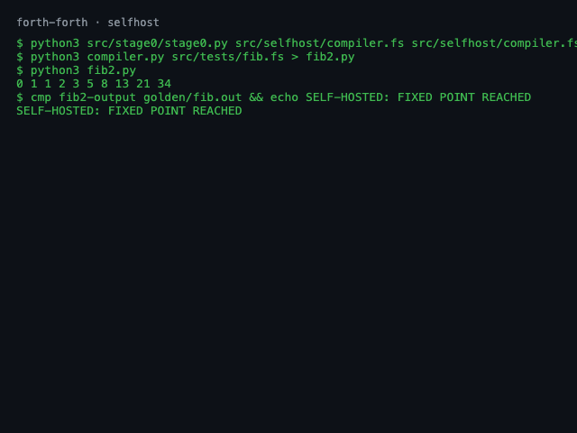
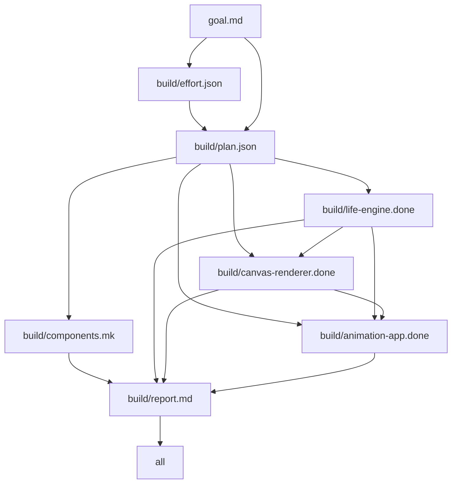

# create-mvp

**Agents write the DAG. `make` runs the agents.**

You type a sentence; a planning agent decomposes it, `jq` turns the plan into
makefile rules, and GNU make schedules one gated build agent per component —
parallel with `-j`, resumable by default, recursive for components too big for
one agent. No orchestrator daemon, no framework: the engine is
[~120 lines of Makefile](engine/build.mk).


*Unedited rebuild of `demos/game-of-life` — `make clean && make -j2`: classify
→ plan → three build agents → review gate, then `make progress` and
`make graph`. Idle time capped at 2s (`asciinema rec -i 2`), so agent thinking
pauses are compressed; nothing else is. Cast:
[`media/engine-run.cast`](media/engine-run.cast).*

## You get what you ask for

Phase 0 of every run classifies *your* effort. A one-liner gets a small, cheap
swarm and a smoke review; a full PRD gets a wide fan-out, a big model, and a
reviewer that checks every acceptance criterion. Same command either way —
the prompt is the budget dial.

|  |  |
|---|---|
| **33 bytes**: ["game of life, make it look alive"](demos/game-of-life/goal.md) | [**5.4 KB PRD**](demos/twitter-x/goal.md): X clone, 3 load-balanced backends |

33 bytes bought 3 agents and a smoke check; 5.4 KB bought 7 agents and a
full-rubric reviewer. Tier mechanics:
[docs/effort-and-hitl.md](docs/effort-and-hitl.md).

All six demos were built by the engine from the goal file shown, unedited:

| | demo | the prompt | tier → plan | what came out |
|---|---|---|---|---|
|  | [game-of-life](demos/game-of-life/) | ["game of life, make it look alive"](demos/game-of-life/goal.md) — 33 bytes | vague → 3 components, smoke review | canvas GoL with age-fade trails, seeded-PRNG eval page, SSIM golden gate. wfcheck 16/16 |
|  | [desk-dashboard](demos/desk-dashboard/) | [94-byte one-liner](demos/desk-dashboard/goal.md) ("…make it pretty") | standard → 5 components | clock/weather/todo dashboard, live open-meteo fetch; first screenshot eval caught invisible-at-first-paint panels, fixed forward. wfcheck 24/24 |
|  | [tui-habits](demos/tui-habits/) | [144-byte one-liner](demos/tui-habits/goal.md) | standard → 5 components | curses habit tracker, streak logic, `tmux capture-pane` text goldens. wfcheck 24/24 |
|  | [twitter-x](demos/twitter-x/) | [5.4 KB PRD](demos/twitter-x/goal.md) | prd → 7 components, full review | X-clone timeline on 3 load-balanced backends (WAL sqlite), round-robin proxy, load stand proving a perfect 105/105/105 split, visual eval ssim 1.0. Built `-j2`. wfcheck 32/32 |
|  | [forth-forth](demos/forth-forth/) | [5.8 KB PRD](demos/forth-forth/goal.md) | prd → 7 components, full review | Forth compiler written in Forth, staged bootstrap, byte-exact pinned goldens — and the stretch goal: [self-hosting fixed point](demos/forth-forth/README.md), gen1 == gen2. First run, zero retries. wfcheck 32/32 |
|  | [site-forge](demos/site-forge/) | [6.2 KB PRD](demos/site-forge/goal.md) with a subsystem inside | prd → 6 components, **1 composite** | static site generator whose plugin subsystem became its own *nested project*: the planner marked it composite on the first call, the subtree self-planned 5 components (loader, hook API, 2 plugins, integration) and passed its own review. Two themes with SSIM-1.0 goldens; forge builds its own docs site. wfcheck parent 29/29, subtree 24/24 |


## Quickstart

Got [Claude Code](https://docs.anthropic.com/en/docs/claude-code)? Setup is
the clone:

```sh
git clone https://github.com/qwadratic/create-mvp && cd create-mvp
ln -s "$PWD/bin/create-mvp" ~/.local/bin/create-mvp   # optional: on PATH
bin/create-mvp "an extension that makes all websites pink"
```

| the one-liner above | delivers |
|---|---|
| `bin/create-mvp "an extension that makes all websites pink"` |  |

No Makefile authoring, no goal file editing — say the thing, get software.
`create-mvp` slugs your sentence into a project dir, writes `goal.md`
verbatim, drops the 3-line Makefile, and runs the full pipeline with a live
progress bar; it exits with the artifact paths and the run's
[wfcheck](evals/wfcheck) score. The default runtime shells out to `claude -p`
— the coding agent you already have *is* the harness. Another one?
`ENGINE_CLI=pi` (or `codex`, `gemini`, `opencode`, any CLI via `custom`) —
see [Runtime](#runtime).

```
 ✓ classify   tier=vague
 ✓ plan       3 components
 ✓ pink-css
 ✓ manifest
 · extension-app
 · review
[################--------] 4/6 (66%)
```

| | |
|---|---|
| `--dry` | classify + plan only — prints the component tree and the cost posture (2 agent calls, zero builds) |
| `--tier vague\|standard\|prd` | override the classifier — the budget dial, by hand |
| `--runtime cli\|sdk\|mock` | agent harness; `mock` = engine-dev stub, full pipeline, zero LLM calls |
| `--board` | don't build now — file the goal as a Backlog.md task (`make board-task` later) |
| `--resume <dir>` | continue a stopped or failed run exactly where it left off (plain `make` resume) |
| `--dir`, `--jobs` | project dir override; `-j` fan-out (default 2) |
| `create-mvp progress <dir>`, `create-mvp graph <dir>` | census bar / mermaid DAG passthroughs |

The goal text is a trust boundary: it lands in `goal.md` verbatim and nowhere
else — the directory name is derived through a `[a-z0-9-]` charset gate, and
nothing from the sentence is ever interpolated into the Makefile or a shell
line. Self-checks (mock runtime, includes an injection attempt):
[`bin/selfcheck-create-mvp.sh`](bin/selfcheck-create-mvp.sh). `create-mvp` is
orchestration only — everything below it is the same engine you can drive by
hand.

**The committed demos rebuild the same way** — real agents, real gates, ends
with the artifact census and the dependency graph:

```sh
make demo                  # wipes + rebuilds demos/game-of-life (the hero gif above) from its 33-byte goal
make demo DEMO=twitter-x   # pick a bigger one
```

Hacking on the *engine*? `make demo-mock` runs the full pipeline — classify →
plan → parallel builds → review gate, one composite subtree included — with
[a 60-line bash stub](engine/fixtures/mock-agent) as the LLM: ~1s, zero
tokens. Ends with the census, the mermaid graph, and a `wfcheck` grade
(17/17). Missing: agent thinking. The DAG, gates, and resume semantics are
what real runs use. `bin/create-mvp --runtime mock "..."` — same stub behind
the one-shot CLI.

Your own project is a folder with two files — `create-mvp` writes both for
you, or by hand:

```sh
mkdir my-thing && cd my-thing
echo "a pomodoro timer, keyboard only" > goal.md
printf 'GOAL ?= goal.md\ninclude ../create-mvp/engine/build.mk\n' > Makefile
make -j4
```

## How it works

```
goal.md ──▶ classify ──▶ effort.json     (jq schema gate)
        ──▶ plan ──────▶ plan.json       (jq: components > 0)
                 jq -r ▶ components.mk   (make re-includes itself, DAG restart)
                         one build agent per component, dep-ordered, -j parallel
                         each gated by its own src/<id>/check.sh
        ──▶ review ────▶ report.md       (grep -q 'VERDICT: PASS')
```

The trick is make's `-include` restart: one `jq -r` line generates
`components.mk` from the agent's plan, then make restarts with a DAG shaped
exactly like the decomposition. `.DELETE_ON_ERROR` deletes a failed agent's
artifact — a failed agent never counts as done, and rerunning `make` resumes
where it stopped. Progress is a filesystem census (`make progress`);
`make graph` parses the rule files back into mermaid. Below:
`make -C demos/game-of-life graph`, verbatim except `$(COMPONENTS)` expanded
to its three members so it renders:



**And it recurses.** A plan component may be `"kind": "composite"` with its
own `sub_goal`: the same `jq -r` line emits a `+$(MAKE) -C src/<id>` recursion
instead of a build agent, and the subtree runs this same engine file — own
classify, own plan, own swarm, own review, its verdict bubbling up as the
parent's `.done`. Planning stays lazy (a subtree is planned when its turn
comes), and the bounds are deterministic jq/make, not prompt trust: a depth
cap (`AGENTMAKE_MAXDEPTH`, default 3) forces leaves at the cap, the subtree's
effort tier is clamped to its parent's (`MAXTIER`), and per-level fan-out is
gated at 8 (`MAXFANOUT`). `make progress` renders per-level bars; `make graph`
emits a mermaid subgraph per composite. Validated on a real PRD:
[demos/site-forge](demos/site-forge/). Design + hostile-case analysis:
[docs/rfc-nested.md](docs/rfc-nested.md).

Every make feature doing real work here — sentinel `.done` targets, order-only
prerequisites, the `$$` two-pass escape, `-j` as a free agent scheduler,
command-line variable origin beating a child's `?=` — is documented with
verbatim excerpts in [docs/engine-internals.md](docs/engine-internals.md).

## Runtime

The agent adapter ([`engine/agent`](engine/agent)) is ~220 lines of bash; the
harness is pluggable:

```sh
make                           # RUNTIME=cli, ENGINE_CLI=claude (default)
make ENGINE_CLI=pi             # pi CLI; native --append-system-prompt
make ENGINE_CLI=codex          # codex exec (system.md prepended to prompt)
make ENGINE_CLI=gemini         # gemini / opencode presets (unverified locally)
ENGINE_CLI=custom ENGINE_CLI_CUSTOM='mycli --oneshot {prompt}' make  # any CLI
make RUNTIME=sdk               # in-process pi SDK (engine/runtime-sdk.mjs)
ENGINE_CLI_FLAGS="--model x" make    # passthrough flags
MODEL_SMALL=... MODEL_LARGE=... make # what the classifier's model hints resolve to
```

| ENGINE_CLI | invocation | system-prompt mechanism | tested here |
|---|---|---|---|
| `claude` (default) | `claude -p`, prompt on stdin | `--append-system-prompt` | flags verified vs `--help`; e2e blocked on creds (TASK-16 on the board) |
| `pi` | `pi -p "<prompt>"` | `--append-system-prompt <file>` | **e2e**: full build, wfcheck 16/16 |
| `codex` | `codex exec`, prompt on stdin, final msg via `-o` | none — system.md prepended to prompt | flags verified vs `exec --help`; e2e blocked (credits) |
| `gemini` | piped stdin = non-interactive | `GEMINI_SYSTEM_MD` replaces (not appends) — prepend instead | **UNVERIFIED-LOCALLY** (web docs; not installed) |
| `opencode` | `opencode run "<prompt>"` | none — prepend | **UNVERIFIED-LOCALLY** (web docs; not installed) |
| `custom` | `ENGINE_CLI_CUSTOM` template, `{prompt}` = one argv slot (never shell-interpolated) or stdin | prepend | argv golden-checked, both stdin + `{prompt}` modes |

Per-agent e2e runs (same goal, fresh dir each):
[evals/runtime-matrix.md](evals/runtime-matrix.md). Dry-render any preset
without an agent call: `engine/agent argv yes PROMPT` (golden-checked by
`engine/selfcheck-argv.sh`). Per-unit overrides — route one hard component to
a big model without upgrading the whole run — go in `build/effort.json`; see
the header of [`engine/agent`](engine/agent).

## Evals: agents lie, files don't

Nothing counts as done until a mechanical check says so. Every eval's exit
code is its verdict, so any of them can sit on a recipe line as a gate:

| tool | checks |
|---|---|
| [`evals/snap`](evals/snap) | HTML → lowres PNG screenshot, ~0.2s/shot ([benchmarks](evals/docs/BENCH.md)) |
| [`evals/evalshot`](evals/evalshot) | screenshot vs. committed golden via ffmpeg SSIM (≥ 0.97); failure writes a `.diff.png` |
| [`evals/apieval`](evals/apieval) | live JSON API → `jq` reshape → [TOON](https://toonformat.dev) encode → diff vs. golden |
| TUI goldens ([recipe](evals/docs/TUI.md)) | `tmux capture-pane` 80×24 text grid vs. `.txt` golden — a terminal is already deterministic |
| [`evals/wfcheck`](evals/wfcheck) | grades a whole finished run: plan schema, DAG validity, check.sh re-runs, census, review verdict → `wfscore.json` |
| [`evals/matrix`](evals/matrix) | same goal through the engine per model; wfcheck score + wall + tokens + cost |

The multi-model matrix, same `wordfreq` goal, same gates
([full report](evals/matrix-results.md)):

| model | wfcheck | score | make | wall (s) | components | tokens | cost (USD) |
|---|---|---|---|---|---|---|---|
| anthropic/claude-haiku-4-5 | 19/20 | 0.95 | exit 2 | 265 | 4 | 547067 | 0.2676 |
| anthropic/claude-sonnet-4-6 | 28/32 | 0.88 | exit 2 | 127 | 7 | 211574 | 0.2785 |
| google/gemini-flash-latest | 28/28 | 1 | ok | 321 | 6 | 1247976 | 1.9685 |

`make` ≠ ok means a gate rejected honestly — `.DELETE_ON_ERROR` threw the
artifact away rather than shipping it. Golden update protocol (an agent is
never allowed to retire its own golden), a live TOON golden from the twitter-x
demo, and the full toolbox: [docs/evals.md](docs/evals.md).

## The board is the work queue

The engine's default goal source is the repo's
[Backlog.md board](backlog/tasks/) ([`engine/board.mk`](engine/board.mk)):

```sh
make board                     # the queue, straight from the backlog CLI
make board-next                # top To Do task -> board/<id>/goal.md -> pipeline
                               #   -> gates pass -> task marked Done via the CLI
make board-task TASK=TASK-7    # explicit pick; also the resume path — a failed
                               #   gate leaves the task In Progress, rerun continues
```

Task = goal unit. The task *description* is the goal body; acceptance
criteria stay on the board and get checked via the CLI as gates pass. Backlog
CLI only — nothing edits `backlog/**/*.md` by hand.

Proof it closes the loop: the board's task-14 — *“Build agentmake with
agentmake”* — was pulled by `make board-next`, decomposed by the engine into
7 components, built dep-ordered under `-j2`, and passed full review — the
produced engine runs a goal end-to-end with a deterministic stub agent, no
LLM in the checks. [wfcheck](evals/wfcheck): 32/32, score 1.0. Artifacts and
the three-run blow-by-blow (the planner hallucination the plan gate caught
twice): [`docs/self-host-run/`](docs/self-host-run/).

**HITL: approval is a file.** `build/approvals/<step>.ok` depends on
`build/<step>.done`; downstream targets consume the `.ok`. Rebuild a step and
its approval is stale by timestamp — the gate re-opens itself. No daemon, no
state, survives restarts:

```sh
# design — pattern rules live in docs/effort-and-hitl.md, not yet wired into engine/build.mk
make pending                    # list open gates
make approve-http-api           # records who/when/sha256 of what was approved
```

`AUTOPILOT=1`, `HUMAN_STEPS`/`AUTO_STEPS` precedence, and the full design
(plus the alternatives it beat):
[docs/effort-and-hitl.md](docs/effort-and-hitl.md).

## Eating the dogfood

We pointed the engine at its own repo — two runs, one ad-hoc `goal.md` each.
Both green: every `check.sh` passed, both reviews said `VERDICT: PASS`.
Both were failures — one never found the real board two dirs up, invented
its own board format, gate-passed its own fixtures; the other left a stray
`report.md` outside its run dir. Gates measure internal
consistency, not integration, and ad-hoc goal files carry no queue semantics —
that's why the board above is the default. Mess committed verbatim under
[`docs/dogfood/`](docs/dogfood/), dissected in
[docs/dogfood-autopsy.md](docs/dogfood-autopsy.md).

## pi extension: demo mode

```sh
pi -e extension/index.ts                                  # try it once
ln -s "$PWD/extension" ~/.pi/agent/extensions/create-mvp   # install
```

Locks the session to a single `create_mvp_demo` tool (built-ins disabled),
streams `make` progress live, adds a `/demo <dir>` command, and bundles the
[`agentic-makefile` skill](extension/skills/agentic-makefile/SKILL.md) so plain
pi sessions know how to scaffold and drive the pipeline.

## Roadmap

Lives on the [Backlog.md board](backlog/tasks/) (`backlog board` to view) —
which is also the work queue, so every item is one `make board-next` away from
being attempted: retry-with-feedback loops, planner JSON hardening,
per-artifact token accounting, persistent CDP screenshot pool.

## Honest limitations

- **No feedback on retry.** A failed gate deletes the artifact; rerunning
  `make` fires a *fresh* agent with no memory of why the last one failed.
  (Agents do iterate against their own `check.sh` within a session — the
  desk-dashboard fix-forward loops — but the engine doesn't pipe gate output
  back yet.)
- **HITL approvals are designed, not default.** `engine/build.mk` ships with
  `.done → .done` edges; wiring the `.ok` layer is a one-line jq change plus
  the documented pattern rules.
- **Sibling integration is copy-based.** Nested decomposition landed (composite
  components recurse, depth ≤ 3, fan-out ≤ 8 per level), but siblings integrate
  by copying each other's files per the plan's description contract — no shared
  artifact store, so a subtree can drift from the sibling it copied. And the
  composite-marking decision has exactly one real-PRD validation datapoint
  (site-forge) so far.
- **Tool-less planners can roleplay.** Deny tools to a planning agent and
  hand it a goal that references files, and it may hallucinate an entire
  tool-call transcript before the JSON (observed on the self-host run — the
  jq gate rejected it twice; retries are paid). Hardening is task-15 on the
  board.
- **Plans are nondeterministic.** Same goal, different runs, different
  component splits. The gates hold either way, but `build/` is not
  bit-reproducible; matrix wall/cost numbers are single-run trends.
- **It spends real money.** The matrix goal — a small CLI — cost $0.27–$1.97
  per run depending on model. A PRD-tier build fans out to 7+ agent sessions.
- **`snap` boots a browser per shot** (~190 ms). Fine at ≤5 shots per check;
  the persistent-CDP-pool upgrade is measured and specced in
  [BENCH.md](evals/docs/BENCH.md) but not built.
- **`make graph` is an awk parser**, not a make introspector: `$(COMPONENTS)`
  prints unexpanded and exotic prerequisite syntax would be missed.
- **First-run goldens are self-seeded.** `evalshot`/`apieval` bootstrap their
  golden from current output with a loud NOTE — a human must eyeball it before
  committing, or the gate gates nothing.

## Docs

- [Engine internals](docs/engine-internals.md) — the make features doing the work, with verbatim excerpts
- [Evals](docs/evals.md) — the toolbox, when each fires, golden update protocol
- [Effort & HITL](docs/effort-and-hitl.md) — effort tiers, knob plumbing, the approval-file design
- [Dogfood autopsy](docs/dogfood-autopsy.md) — the mess that made the board the default, tree snapshot verbatim
- [Self-host run](docs/self-host-run/) — task-14 artifacts + the three-run story
- [Naming](docs/naming.md) — why `create-mvp` (the `create-react-app` scaffolder lineage), and everything it beat
- [demoscene/](demoscene/README.md) — the forth-forth evolution session rendered as a graded cut (proxy-attention, honesty-labeled)
