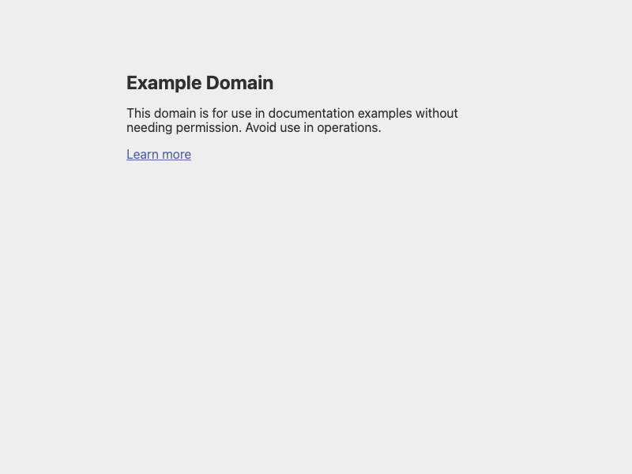
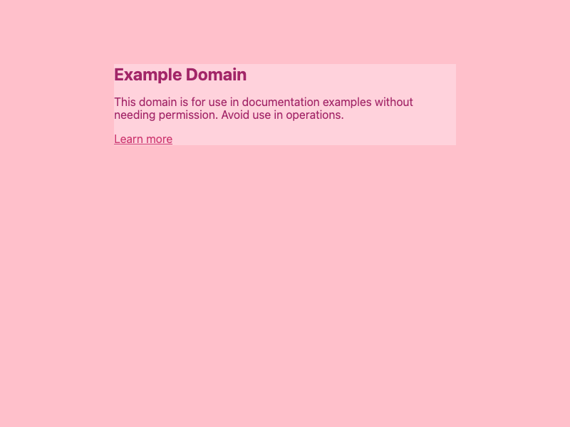

# pink-extension — the one-shot API example, run for real

The sentence from the README's API vision, executed verbatim:

```sh
create-mvp "an extension that makes all websites pink" --dir /tmp/pink-demo --runtime cli
```

No Makefile authored, no plan written, no component list — one sentence in,
a loadable Chrome extension out.


## What the engine did

```
goal.md ──▶ classify: tier=vague ──▶ plan: 3 components ──▶ build agents ──▶ review: PASS
```

Plan the agents chose (nobody told them "manifest v3" or "content script"):

- `pink-css-injector` — content script injecting `!important` pink CSS via a
  `<style>` tag; pure `buildPinkCss()` export so it's Node-testable sans browser
- `extension-manifest` — Manifest V3, `<all_urls>` content script at
  `document_start` *(← depends on pink-css-injector)*
- `packaging-check` — assembles the tree in a tempdir, validates every
  manifest-referenced file exists + `node --check` parses, and includes a
  negative self-test (delete content.js → must fail)

First run, zero retry loops. Review `VERDICT: PASS`, `wfcheck: PASS 16/16 (score 1)`.

## The pink gate (visual, not vibes)

`ext/` is the assembled loadable extension (manifest.json + content.js).
Loaded into real Chromium headless via `--load-extension`, then screenshotted
against https://example.com:

| before | after |
|---|---|
|  |  |

Background `#ffc0cb`, content card `#ffd6e0`, text `#8b004f`. Pink.

## Try it yourself

```sh
# load ext/ at chrome://extensions (Developer mode → Load unpacked), or:
bash src/packaging-check/check.sh   # full component check chain
```

Files: `goal.md` (the verbatim sentence), `buildlog.txt` (full pipeline log),
`report.md` (review verdict), `src/` (per-component outputs + self-tests).
